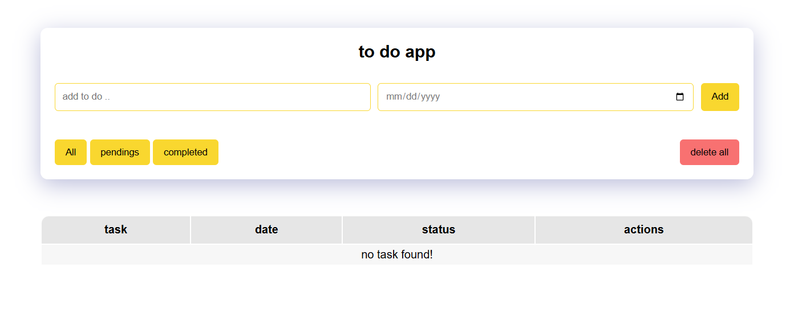

# 🚀 Todo App

یک اپلیکیشن ساده برای مدیریت کارها کد زده شده است. 
این پروژه برای تمرین مفاهیم پایه جاوااسکریپت و مدیریت داده‌ها ساخته شده است  

---

## ✨ ویژگی‌ها
- ➕ اضافه کردن کار جدید
- 🗑️ حذف کار
- 💾 ذخیره‌سازی در LocalStorage
- 📱 طراحی ریسپانسیو (مناسب موبایل و دسکتاپ)
- مشخص کردن  وضعیت کار
-  مشخص کردن ددلاین

---

## 🛠️ تکنولوژی‌ها
- HTML5  
- CSS3 (Flexbox, Grid, Responsive Design)  
- JavaScript (ES6+, DOM, LocalStorage)  

---

## 🎯 دموی آنلاین
👉 [مشاهده پروژه در GitHub Pages](https://github.com/zahramalekpour/todoapp)

---

## 📸 اسکرین‌شات

